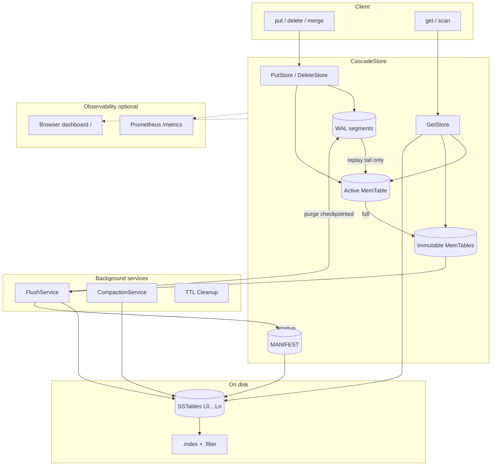

#  CascadeStore

CascadeStore is a Java 17 LSM-tree key-value engine. Writes are buffered in an ordered in-memory table, made durable through a write-ahead log, and eventually flushed into immutable on-disk SSTables. Off-heap value storage, bloom filters, and optional block caching keep heap churn low while reads stay predictable as data grows.

**Read the full write-up on Medium:** [Building CascadeStore — a Java LSM engine](https://medium.com/@arnabk1108/building-cascadestore-a-java-lsm-engine-eb45edefa17e?postPublishedType=initial)

## Contents

- [What it does](#what-it-does)
- [Capabilities](#capabilities)
- [Getting started](#getting-started)
- [Tuning & configuration](#tuning--configuration)
- [Architecture](#architecture)
- [Observability](#observability)
- [Benchmarks](#benchmarks)
- [Further reading](#further-reading)

## What it does

The engine follows the standard LSM lifecycle: mutations land in a mutable MemTable and WAL, immutable MemTables flush to level-0 SSTables, and background compaction rewrites overlapping files so read amplification stays bounded. The design targets write-heavy and mixed workloads—event ingestion, caching layers, and append-oriented storage—where sequential disk I/O and batched durability matter.


| Layer                   | Role                                                                     |
| ----------------------- | ------------------------------------------------------------------------ |
| **MemTable**            | Concurrent skip-list index with off-heap value payloads                  |
| **WAL**                 | Append-only recovery log with batched `fsync` and MANIFEST checkpointing |
| **SSTable**             | Sorted data files with sparse indexes and bloom filters                  |
| **Background services** | Flush, compaction (three strategies), and TTL cleanup                    |
| **Metrics**             | Optional Prometheus scrape endpoint and browser dashboard                |


## Capabilities

- **Durable writes** — WAL group-commit (`fsync` every 1 MiB by default) with forced sync on MemTable rotation
- **MANIFEST checkpointing** — incremental WAL replay after flush; purge checkpointed log segments
- **Compaction policies** — `THRESHOLD`, `SIZE_TIERED`, or `LEVEL_TIERED` background merges
- **TTL and tombstones** — per-key expiration and delete markers survive flush and compaction
- **Read path** — bloom filters (0.5% default FPR), sparse indexes (~16 KiB spacing), mmap-backed data reads
- **Block cache** — optional per-shard LRU cache (`blockCacheSizeBytes`; `0` disables)
- **SSTable compression** — optional LZ4 on disk (`withSstableLz4Enabled`)
- **Concurrency** — `StorageVersion` snapshots pin SSTables for lock-free reads; parallel bloom probes when many tables are open
- **Native merge** — `merge()` for single-walk read-modify-write (YCSB updates)

**Requirements:** JDK 17+, Maven 3.6+

## Getting started

```bash
git clone https://github.com/ArnabKarmakar1108/CascadeStore.git
cd CascadeStore
mvn clean install
```

```java
Storage storage = new CascadeStore();
storage.put("key".getBytes(), "value".getBytes());
byte[] value = storage.get("key".getBytes());
storage.shutdown();
```

Range scans, TTL puts, and iterators are supported — see [core/README.md](src/main/java/io/cascadestore/lsm/core/README.md).

**YCSB smoke test:**

```bash
./scripts/run-ycsb.sh all workloada-dryrun LEVEL_TIERED
```

## Tuning & configuration

`CascadeConfig` centralizes knobs you set before opening a store:


| Knob                               | Default / typical  | Effect                                                 |
| ---------------------------------- | ------------------ | ------------------------------------------------------ |
| MemTable size                      | 10 MB – 256 MB     | Flush frequency, ingest burst capacity                 |
| Compaction threshold               | 4 SSTables         | When background compaction triggers                    |
| Compaction strategy                | `THRESHOLD`        | Write vs read amplification trade-off                  |
| Block cache                        | 128 MB (`0` = off) | Hot block reuse on repeated reads                      |
| SSTable LZ4                        | off                | On-disk compression for data blocks                    |
| Parallel bloom                     | on (≥3 SSTables)   | Multi-threaded bloom probes on wide reads              |
| Metrics                            | off                | Prometheus `/metrics` + dashboard on configurable port |
| Flush / compaction / TTL intervals | config fields      | Background service cadence                             |


```java
CascadeConfig config = new CascadeConfig(
    256 * 1024 * 1024, "./data", 4, 30, 1, 10,
    CompactionStrategyType.LEVEL_TIERED,
    128 * 1024 * 1024,   // block cache
    true, 3              // parallel bloom
)
    .withSstableLz4Enabled(true)
    .withMetricsEnabled(true)
    .withMetricsPort(9090);

Storage store = new CascadeStore(config);
```


| Strategy       | Best for                                          |
| -------------- | ------------------------------------------------- |
| `THRESHOLD`    | Simple default; compacts the busiest level        |
| `SIZE_TIERED`  | Sustained bulk ingest; lower write amplification  |
| `LEVEL_TIERED` | Read-heavy steady state; lower read amplification |

## Architecture



**Write path:** WAL append → MemTable → (on rotation) flush to SSTable → advance MANIFEST checkpoint → purge old WAL segments.

**Read path:** active MemTable → immutable MemTables → SSTables (bloom filter → sparse index → data file).

**Recovery:** load MANIFEST and SSTables, then replay only WAL records after `flushed_wal_sequence`.

## Observability

Enable metrics on `CascadeConfig` (`withMetricsEnabled(true)`, default port 9090):

- `GET /metrics` — Prometheus text exposition (throughput counters, amplification, flush/compaction histograms, block-cache hit rate, WAL fsync latency)
- `GET /` — live browser dashboard with grouped cards and auto-refresh

Metrics dashboard

```bash
curl -s http://localhost:9090/metrics | grep cascadestore_
```

See [metrics/README.md](src/main/java/io/cascadestore/lsm/metrics/README.md) for the full metric catalog, example PromQL, and Grafana panel ideas.

## Benchmarks

YCSB macrobenchmarks are published under [benchmark/](benchmark/README.md). Headline throughput @ 1M (8×8, cache off): **177k** write ops/s (size-tiered, Workload A) and **93k** read ops/s (level-tiered, Workload C).

**Throughput vs dataset size** — separate tuned runs per workload; throughput rises through mid-scale, then dips slightly at 1M as the LSM deepens.

Throughput vs scale

**Compaction strategy — read throughput (Workload C)** — level-tiered leads on pure reads under a frozen-compaction read track.

Read throughput by strategy

More suites: [strategy comparison](benchmark/strategy-comparison/) · [vs RocksDB / LevelDB](benchmark/comparison/) · [scaling matrix](benchmark/scaling-matrix/) · [throughput by scale](benchmark/throughput-by-scale/)

Microbenchmarks (JMH) and the YCSB harness: [src/test/java/io/cascadestore/lsm/benchmark/README.md](src/test/java/io/cascadestore/lsm/benchmark/README.md).

## Further reading


| Document                                                                                                                                                                                                                                                  | Contents                           |
| --------------------------------------------------------------------------------------------------------------------------------------------------------------------------------------------------------------------------------------------------------- | ---------------------------------- |
| [ARCHITECTURE.md](src/main/java/io/cascadestore/lsm/docs/ARCHITECTURE.md)                                                                                                                                                                                 | Write/read/recovery paths in depth |
| [DATA_FLOW.md](src/main/java/io/cascadestore/lsm/docs/DATA_FLOW.md)                                                                                                                                                                                       | End-to-end data movement           |
| [OPTIMIZATIONS.md](src/main/java/io/cascadestore/lsm/docs/OPTIMIZATIONS.md)                                                                                                                                                                               | Implemented performance work       |
| [core/](src/main/java/io/cascadestore/lsm/core/README.md) · [memtable/](src/main/java/io/cascadestore/lsm/memtable/README.md) · [sstable/](src/main/java/io/cascadestore/lsm/sstable/README.md) · [wal/](src/main/java/io/cascadestore/lsm/wal/README.md) | Package-level notes                |


---

LSM foundations: [O'Neil et al., 1996](https://www.cs.umb.edu/~poneil/lsmtree.pdf). Design influenced by LevelDB, RocksDB, and Cassandra. See [LICENSE](LICENSE).
