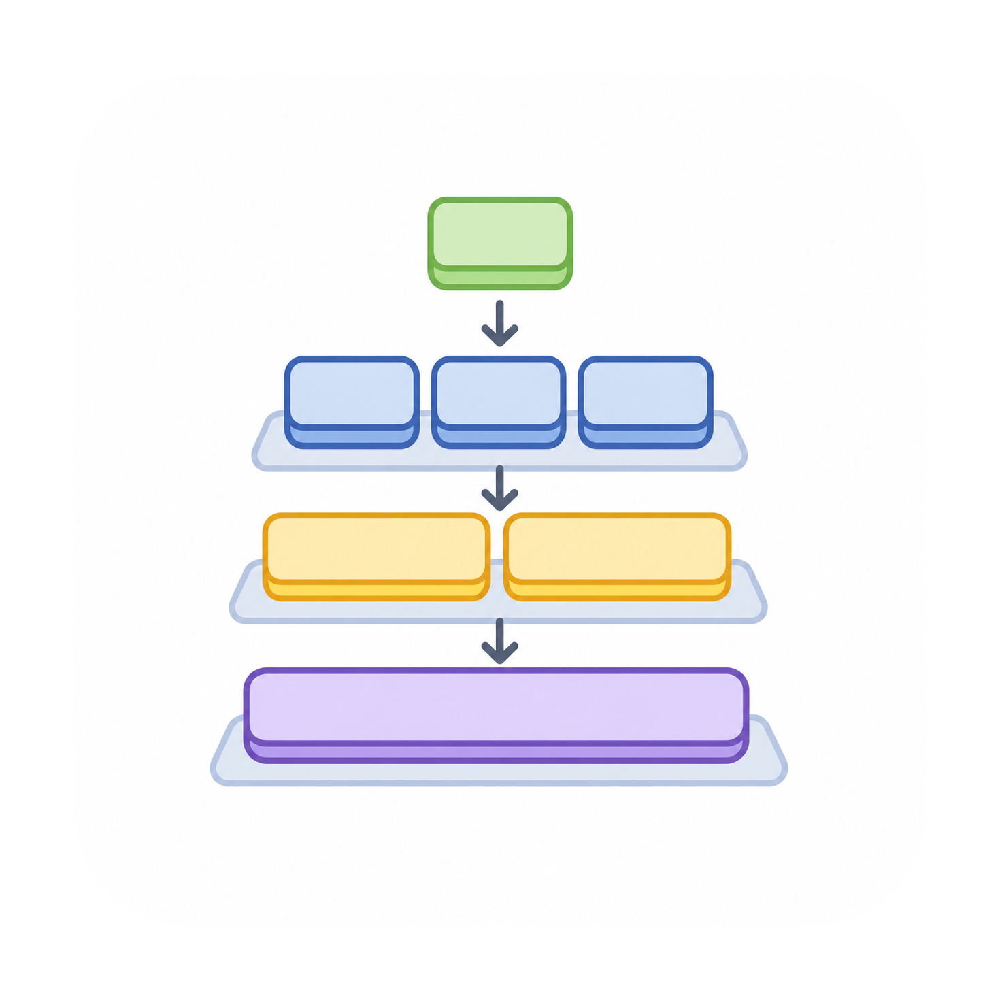
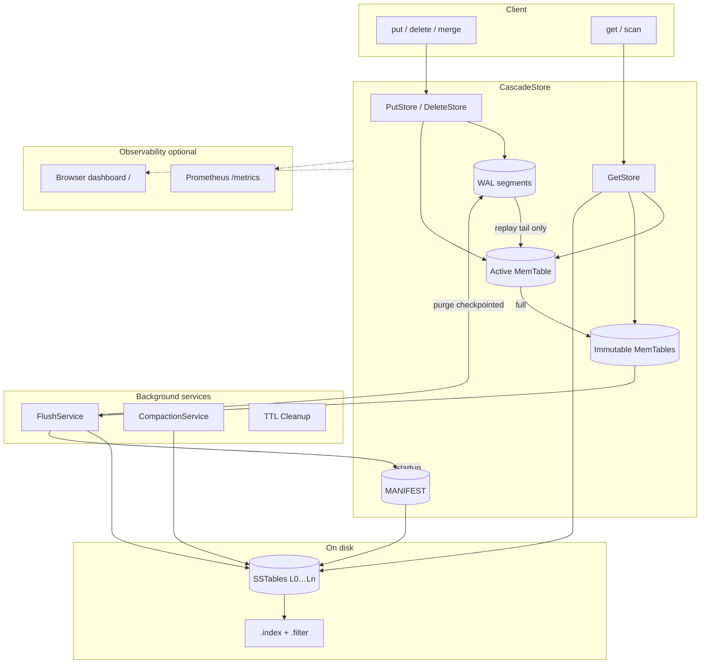

#  CascadeStore

[](https://openjdk.java.net/projects/jdk/17/)

CascadeStore is a Java 17 LSM-tree key-value engine. Writes are buffered in an ordered in-memory table, made durable through a write-ahead log, and eventually flushed into immutable on-disk SSTables. Off-heap value storage, bloom filters, and optional block caching keep heap churn low while reads stay predictable as data grows.

## Table of Contents

- [Overview](#overview)
- [Features](#features)
- [Requirements](#requirements)
- [Installation](#installation)
- [Usage](#usage)
- [Architecture](#architecture)
- [Performance](#performance)
- [Documentation](#documentation)
- [Contributing](#contributing)
- [Acknowledgements](#acknowledgements)

## Overview

The engine follows the standard LSM lifecycle: mutations land in a mutable MemTable and WAL, immutable MemTables flush to level-0 SSTables, and background compaction rewrites overlapping files so read amplification stays bounded. The design targets write-heavy workloads—event ingestion, caching layers, and append-oriented storage—where sequential disk I/O and batched durability matter more than immediate read consistency across replicas.

Main building blocks:

- **MemTable** — concurrent skip-list index with off-heap value payloads
- **WAL** — append-only recovery log with batched `fsync` and MANIFEST checkpointing
- **SSTable** — sorted data files with sparse indexes and bloom filters
- **Background services** — flush, compaction (three strategies), and TTL cleanup
- **Metrics** — optional Prometheus scrape endpoint and browser dashboard

## Features

- **Durable writes** — WAL group-commit (`fsync` every 1 MiB by default) with forced sync on MemTable rotation
- **MANIFEST checkpointing** — incremental WAL replay after flush; purge checkpointed log segments
- **Ordered storage** — keys stay sorted for range scans and merge iterators
- **Compaction policies** — threshold, size-tiered, or level-tiered background merges
- **TTL and tombstones** — per-key expiration and delete markers survive flush and compaction
- **Read optimizations** — bloom filters (0.5% default FPR), sparse indexes (~16 KiB spacing), mmap-backed data reads, optional LRU block cache
- **Concurrency** — `StorageVersion` snapshots pin SSTables for lock-free reads; parallel bloom probes when many tables are open
- **Observability** — Prometheus metrics (`/metrics`) and a live browser dashboard (`/`) when enabled via `CascadeConfig`
- **Off-heap memory** — direct `ByteBuffer` allocation with explicit cleanup via `Unsafe.invokeCleaner()`
- **Configurable tuning** — MemTable size, compaction thresholds, block cache size, bloom parallelism via `CascadeConfig`

## Requirements

- JDK 17 or newer
- Apache Maven 3.6+ on your `PATH` (this repo does not ship a Maven Wrapper)

## Installation

### Maven dependency

Add the artifact when published locally or to a repository mirror:

```xml
<dependency>
    <groupId>io.cascadestore</groupId>
    <artifactId>cascade-store</artifactId>
    <version>1.0-SNAPSHOT</version>
</dependency>
```

### Build from source

```bash
git clone https://github.com/ArnabKarmakar1108/CascadeStore.git
cd CascadeStore
mvn clean install
```

The `Makefile` wraps common Maven targets (`make test`, `make package`, etc.).

## Usage

### Basic operations

```java
// Defaults: 10 MB MemTable, ./data, threshold compaction
Storage storage = new CascadeStore();

// Custom MemTable cap, data directory, and compaction trigger
Storage storage = new CascadeStore(
    10 * 1024 * 1024,  // 10 MB
    "./data",
    4                  // compact when four SSTables accumulate at a level
);

storage.put("key".getBytes(), "value".getBytes());
byte[] value = storage.get("key".getBytes());
storage.delete("key".getBytes());
boolean present = storage.containsKey("key".getBytes());
List<byte[]> keys = storage.listKeys();
int count = storage.size();
storage.clear();
storage.shutdown();
```

### Range scans

```java
byte[] startKey = "a".getBytes();
byte[] endKey = "z".getBytes();

Map<byte[], byte[]> slice = storage.getRange(startKey, endKey);

try (KeyValueIterator iterator = storage.getIterator(startKey, endKey)) {
    while (iterator.hasNext()) {
        Map.Entry<byte[], byte[]> entry = iterator.next();
        // use entry.getKey() / entry.getValue()
    }
}
```

### Time-to-live

```java
// Expire after 60 seconds
storage.put("key".getBytes(), "value".getBytes(), 60);
```

### Compaction and tuning

Three compaction strategies are available via `CompactionStrategyType`:

| Strategy | Behavior |
|----------|----------|
| **THRESHOLD** | Merge when a level holds enough SSTables (default) |
| **SIZE_TIERED** | Group similarly sized files and compact together |
| **LEVEL_TIERED** | L0 count trigger plus per-level byte budgets; L0 jobs pull overlapping L1 files |

```java
Storage sizeTiered = new CascadeStore(
    10 * 1024 * 1024, "./data", 4, CompactionStrategyType.SIZE_TIERED);

CascadeConfig config = new CascadeConfig(
    256 * 1024 * 1024,  // MemTable
    "./data",
    4,                  // compaction threshold
    30,                 // compaction check interval (minutes)
    1,                  // TTL cleanup interval (minutes)
    10,                 // flush interval (seconds)
    CompactionStrategyType.LEVEL_TIERED,
    128 * 1024 * 1024,  // block cache (0 = disabled)
    true,               // parallel bloom probes
    3                   // min SSTables before parallel bloom
);
Storage tuned = new CascadeStore(config);
```

## Architecture



**Write path:** WAL append → MemTable → (on rotation) flush to SSTable → advance MANIFEST checkpoint → purge old WAL segments.

**Read path:** active MemTable → immutable MemTables → SSTables (bloom filter → sparse index → data file).

**Recovery:** load MANIFEST and SSTables, then replay only WAL records after `flushed_wal_sequence`.

Package layout under `io.cascadestore.lsm`:

| Package | Role |
|---------|------|
| **core** | `CascadeStore` facade; `PutStore` / `GetStore` / `DeleteStore`; flush, compaction, and TTL services |
| **memtable** | Active and immutable in-memory tables with off-heap values |
| **sstable** | On-disk sorted tables: data, sparse index, and bloom filter files |
| **wal** | Append-only log, rotation, checkpoint purge, and crash recovery |
| **manifest** | MANIFEST checkpoint (live SSTables + WAL replay frontier) |
| **metrics** | Prometheus collectors, HTTP dashboard, and demo workload |
| **io** | Block cache, buffered/mmap data readers, buffer pools |
| **config** | `CascadeConfig` and compaction strategy types |

Deeper design notes live under `src/main/java/io/cascadestore/lsm/docs/`:

- [ARCHITECTURE.md](src/main/java/io/cascadestore/lsm/docs/ARCHITECTURE.md) — write/read/recovery paths
- [DATA_FLOW.md](src/main/java/io/cascadestore/lsm/docs/DATA_FLOW.md) — end-to-end data movement
- [OPTIMIZATIONS.md](src/main/java/io/cascadestore/lsm/docs/OPTIMIZATIONS.md) — implemented performance work

Each major package also has a local README with module-specific detail.

## Performance

Microbenchmarks (JMH) and macrobenchmarks (YCSB) live under `src/test/java/io/cascadestore/lsm/benchmark/`. See [benchmark/BENCHMARKS.md](benchmark/BENCHMARKS.md) for recorded YCSB results and run matrices.

Reported throughput depends heavily on hardware, MemTable sizing, compaction pressure, JVM flags, and whether the block cache is enabled. Phase F YCSB Workload A @ 1M (4 shards × 4 threads, block cache off) reached roughly 8–13k ops/s on cold trial-1 runs depending on compaction strategy; warm matrix repeats were significantly higher.

Run a quick YCSB smoke test:

```bash
./scripts/run-ycsb.sh workloada-dryrun
```

## Documentation

| Document | Contents |
|----------|----------|
| [core/README.md](src/main/java/io/cascadestore/lsm/core/README.md) | Store orchestration and background services |
| [memtable/README.md](src/main/java/io/cascadestore/lsm/memtable/README.md) | In-memory table layout |
| [sstable/README.md](src/main/java/io/cascadestore/lsm/sstable/README.md) | On-disk format and lookup path |
| [wal/README.md](src/main/java/io/cascadestore/lsm/wal/README.md) | WAL record format and file lifecycle |
| [metrics/README.md](src/main/java/io/cascadestore/lsm/metrics/README.md) | Prometheus metrics and dashboard |
| [benchmark README](src/test/java/io/cascadestore/lsm/benchmark/README.md) | JMH and YCSB harnesses |

## Contributing

Issues and pull requests are welcome. Please include a concise description of the change and any tests you added.

## Acknowledgements

- LSM-tree foundations: ["The Log-Structured Merge-Tree (LSM-Tree)"](https://www.cs.umb.edu/~poneil/lsmtree.pdf) by Patrick O'Neil et al.
- Design inspiration from LevelDB, RocksDB, Cassandra, and related open-source engines.
