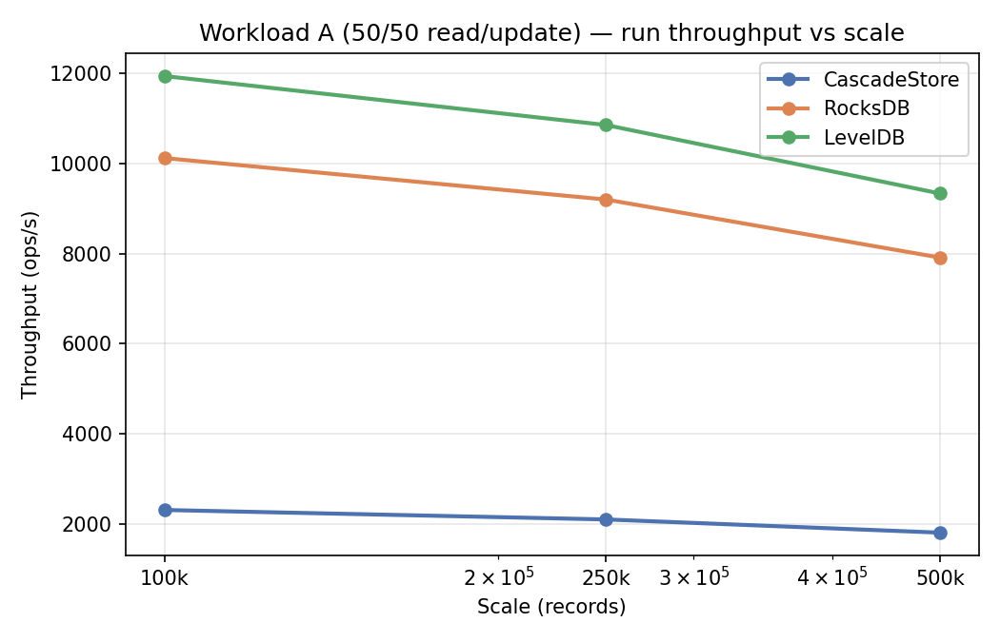
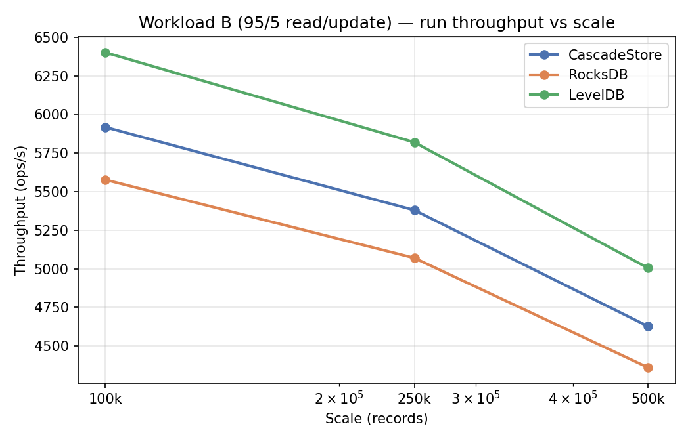
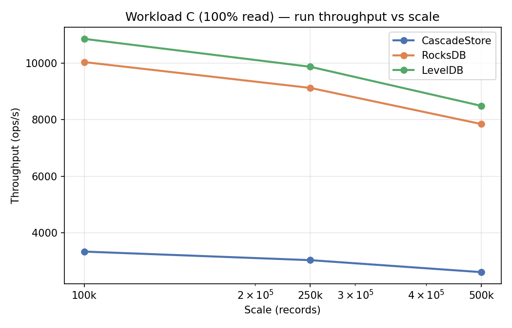
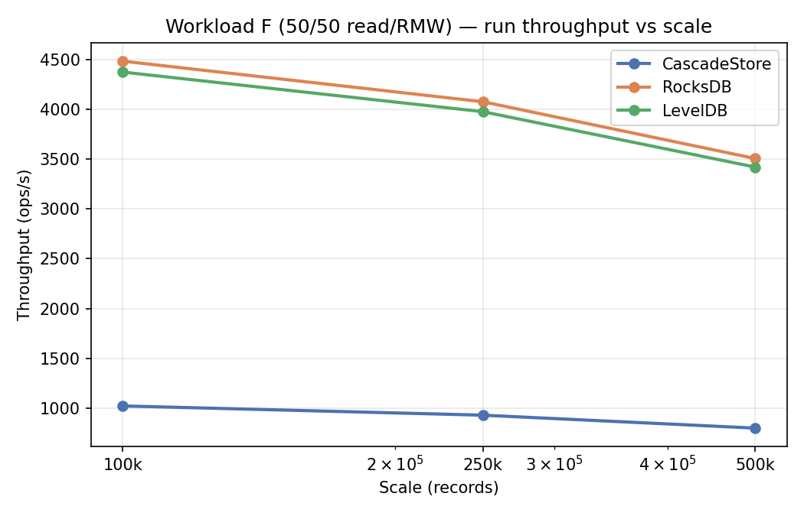

# CascadeStore vs RocksDB / LevelDB — YCSB Comparison

Embedded Java LSM vs native C++ reference engines at **100k, 250k, and 500k** records.

**Run dates:** 2026-07-31 (CascadeStore, RocksDB) · 2026-08-01 (LevelDB)  
**Raw output:** `benchmark/results/comparison-20260801/`, `comparison-leveldb-20260801/`

All cells completed with 0 errors.

---

## Config (compaction stress)

| Setting | Value | Notes |
|---------|-------|-------|
| Scales | **100k, 250k, 500k** | records / operations |
| Threads | 1 | Embedded binding |
| Shards | 1 | One engine instance |
| MemTable / write buffer | **64 MB** | |
| L0 compaction trigger | **2** | CascadeStore only |
| Flush interval (CascadeStore) | **5 s** | |
| Compaction interval (CascadeStore) | **~10 s** (`0.17` min) | |
| Block cache | **128 MB** | Per engine instance |
| JVM | `-Xms2G -Xmx4G`, G1GC | |
| CascadeStore strategy | **LEVEL_TIERED** | |
| RocksDB | Leveled compaction, Snappy (default) | |
| LevelDB | Leveled compaction (always) | |
| Workloads | **A, B, C, F** | Same `YcsbRecordCodec` key/value layout |

### Hardware & software

| Component | Detail |
|-----------|--------|
| CPU | 2× Intel Xeon E5-2630 v3 @ 2.40 GHz |
| RAM | 32 GiB |
| Storage | Local disk (container volume) |
| OS | Linux 5.4 (el7.elrepo) |
| JDK | OpenJDK 17.0.18 |

---

## Run throughput by scale

### Workload A (50/50 read/update, zipfian)

| Scale | CascadeStore | RocksDB | LevelDB |
|-------|-------------|---------|---------|
| 100k | 2,306 | 10,120 | 11,941 |
| 250k | 2,096 | 9,200 | 10,855 |
| 500k | 1,803 | 7,912 | 9,335 |

### Workload B (95/5 read/update, zipfian)

| Scale | CascadeStore | RocksDB | LevelDB |
|-------|-------------|---------|---------|
| 100k | 5,918 | 5,577 | 6,402 |
| 250k | 5,380 | 5,070 | 5,820 |
| 500k | 4,627 | 4,360 | 5,005 |

### Workload C (100% read, latest)

| Scale | CascadeStore | RocksDB | LevelDB |
|-------|-------------|---------|---------|
| 100k | 3,334 | 10,039 | 10,861 |
| 250k | 3,031 | 9,126 | 9,874 |
| 500k | 2,607 | 7,848 | 8,492 |

### Workload F (50/50 read/RMW, zipfian)

| Scale | CascadeStore | RocksDB | LevelDB |
|-------|-------------|---------|---------|
| 100k | 1,020 | 4,487 | 4,377 |
| 250k | 927 | 4,079 | 3,979 |
| 500k | 797 | 3,508 | 3,422 |

---

## Results @ 250k (detail)

### Workload A

| Engine | Load (ops/s) | Run (ops/s) | Read p99 (µs) | Update p99 (µs) |
|--------|-------------|-------------|---------------|-----------------|
| CascadeStore (LTCS) | 1,611 | 2,096 | 3,780 | 3,882 |
| RocksDB | 4,877 | 9,200 | 300 | 846 |
| LevelDB | 12,381 | 10,855 | 89 | 139 |

### Workload B

| Engine | Load (ops/s) | Run (ops/s) | Read p99 (µs) | Update p99 (µs) |
|--------|-------------|-------------|---------------|-----------------|
| CascadeStore (LTCS) | 2,166 | 5,380 | 2,516 | 3,175 |
| RocksDB | 6,720 | 5,070 | 642 | 5,111 |
| LevelDB | 9,634 | 5,820 | 113 | 388 |

### Workload C

| Engine | Load (ops/s) | Run (ops/s) | Read p99 (µs) |
|--------|-------------|-------------|---------------|
| CascadeStore (LTCS) | 2,052 | 3,031 | 3,265 |
| RocksDB | 5,453 | 9,126 | 149 |
| LevelDB | 15,285 | 9,874 | 66 |

### Workload F

| Engine | Load (ops/s) | Run (ops/s) | Read p99 (µs) | RMW p99 (µs) |
|--------|-------------|-------------|---------------|--------------|
| CascadeStore (LTCS) | 4,069 | 927 | 7,210 | 75,320 |
| RocksDB | 7,083 | 4,079 | 200 | 396 |
| LevelDB | 8,275 | 3,979 | 147 | 407 |

---

## Charts









---

## Notes

- **Key/value encoding** is identical (`YcsbRecordCodec`) in all bindings.
- **CascadeStore `update()`** uses native `merge()` (one LSM walk). **RocksDB / LevelDB `update()`** uses get + put.
- Native engines lead on read-heavy Workload C; LevelDB is competitive on mixed workloads A/B.
- Throughput falls modestly from 100k → 500k as compaction and SSTable depth increase.

## Run commands

```bash
COMPARISON_SCALE=250000 ./scripts/run-comparison-cascade-stress.sh
COMPARISON_SCALE=250000 ./scripts/run-comparison-rocksdb-stress.sh
COMPARISON_SCALE=250000 ./scripts/run-comparison-leveldb-stress.sh
```

## Data

| File | Use |
|------|-----|
| [`comparison.csv`](comparison.csv) | All engines × workloads × scales |
| [`comparison_by_scale.csv`](comparison_by_scale.csv) | Same data (plot input) |

Raw output: `benchmark/results/comparison-20260801/`, `benchmark/results/comparison-leveldb-20260801/`
