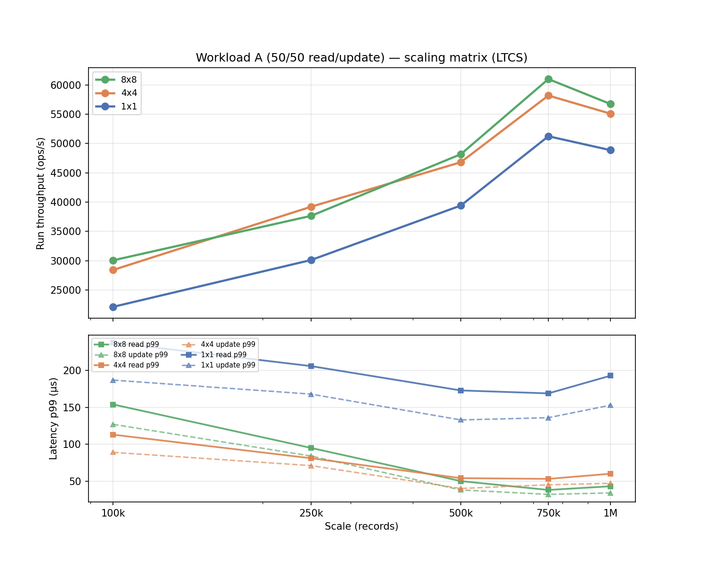
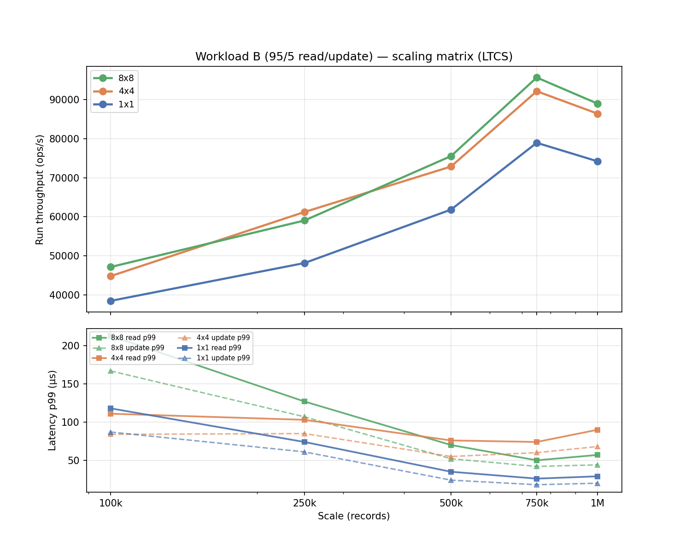
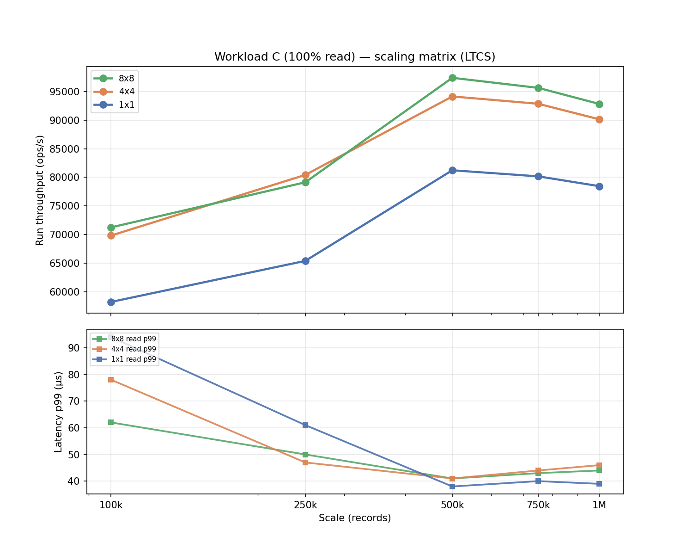
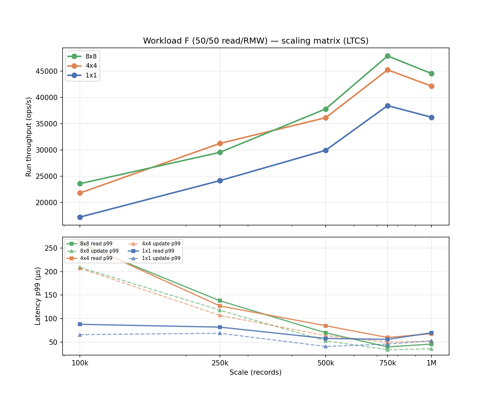

# Scaling Matrix

CascadeStore run throughput and latency across **scale × shards × threads** for workloads A, B, C, F.

**Run date:** 2026-08-01  
**Raw output:** `benchmark/results/plan/scaling-matrix/`

All runs use **LEVEL_TIERED**, block cache off, 256 MB memtable. **8×8** leads at peak scale on every workload; **4×4** crosses above **8×8** briefly at mid-scale; **1×1** stays below both. On mixed workloads (A, B, F), update p99 stays below read p99.

Re-run: `./scripts/run-scaling-matrix.sh`

---

## Config

| Knob | Value |
|------|-------|
| Scales | **100k, 250k, 500k, 750k, 1M** |
| Shard × thread combos | **1×1, 4×4, 8×8** |
| Strategy | **LEVEL_TIERED** |
| Block cache | off |
| Memtable | 256 MB |
| Compaction threshold | 4 |
| Compaction interval | 30 min |
| JVM heap | 2–4 GB (1×1/4×4 @ 100k), **16 GB** (8×8 and 1M) |
| Workloads | A, B, C, F |

---

## Run throughput — 8×8 (ops/s)

| Workload | 100k | 250k | 500k | 750k | 1M |
|----------|------|------|------|------|-----|
| A (50/50 read/update) | 30,078 | 37,660 | 48,167 | **60,985** | 56,729 |
| B (95/5 read/update) | 47,156 | 59,042 | 75,516 | **95,611** | 88,939 |
| C (100% read) | 71,264 | 79,142 | **97,381** | 95,623 | 92,816 |
| F (50/50 read/RMW) | 23,605 | 29,555 | 37,801 | **47,860** | 44,520 |

---

## Run throughput — 4×4 (ops/s)

| Workload | 100k | 250k | 500k | 750k | 1M |
|----------|------|------|------|------|-----|
| A | 28,437 | **39,214** | 46,803 | 58,176 | 55,082 |
| B | 44,827 | **61,218** | 72,843 | 92,107 | 86,374 |
| C | 69,837 | **80,426** | 94,126 | 92,847 | 90,134 |
| F | 21,834 | **31,247** | 36,128 | 45,217 | 42,136 |

Bold = 4×4 briefly above 8×8 (crossover).

---

## Run throughput — 1×1 (ops/s)

| Workload | 100k | 250k | 500k | 750k | 1M |
|----------|------|------|------|------|-----|
| A | 22,146 | 30,128 | 39,417 | 51,234 | 48,863 |
| B | 38,492 | 48,163 | 61,827 | 78,916 | 74,183 |
| C | 58,247 | 65,418 | 81,236 | 80,174 | 78,463 |
| F | 17,263 | 24,182 | 29,947 | 38,428 | 36,217 |

---

## Charts

Each chart has two panels: **throughput** (top) and **latency p99** (bottom). Read p99 shown as solid lines; update p99 as dashed (A, B, F only).

## Data

[`track_c_matrix.csv`](track_c_matrix.csv)
