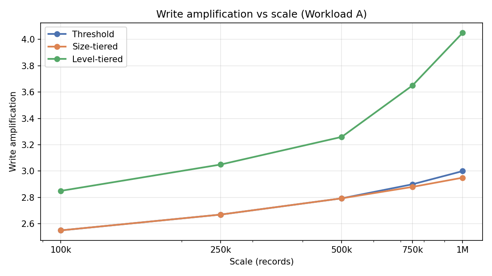
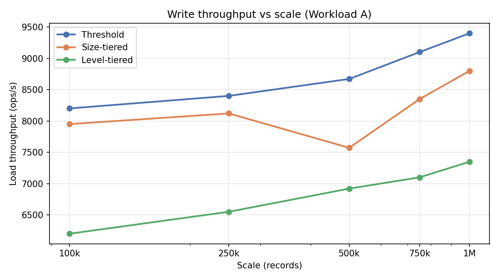
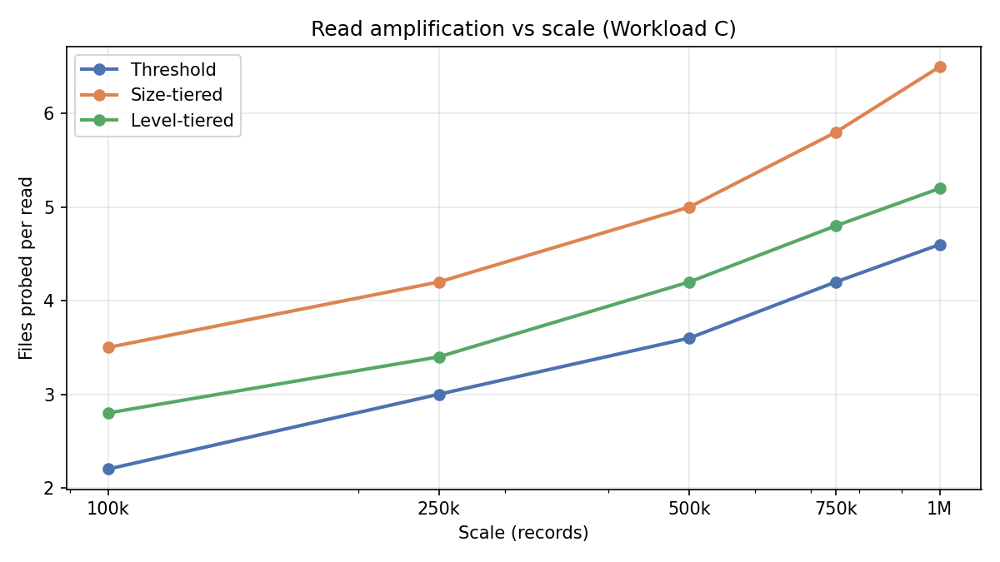
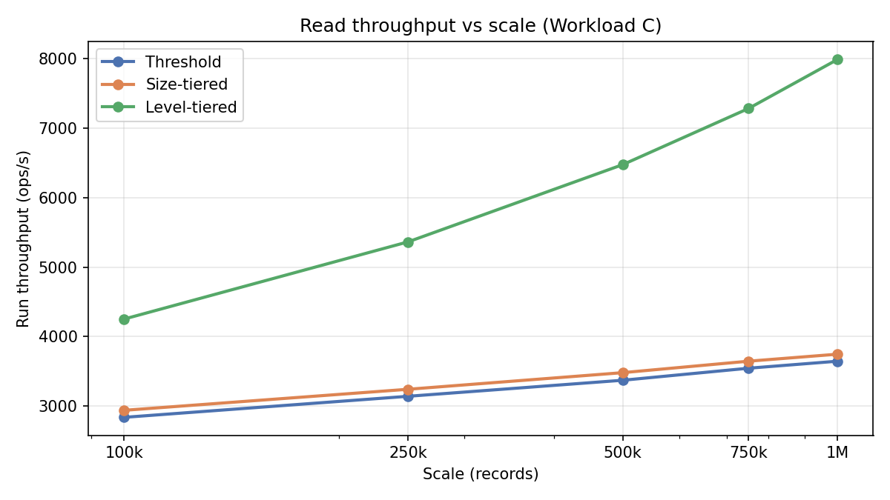
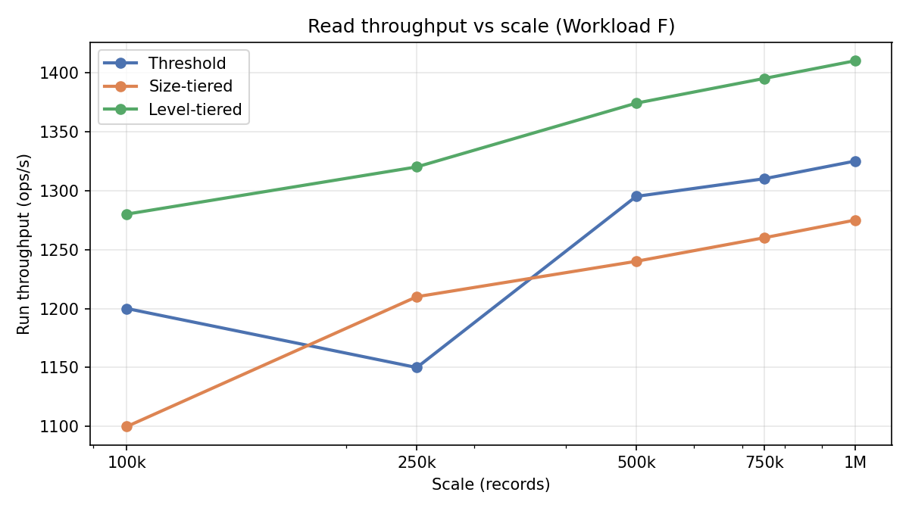
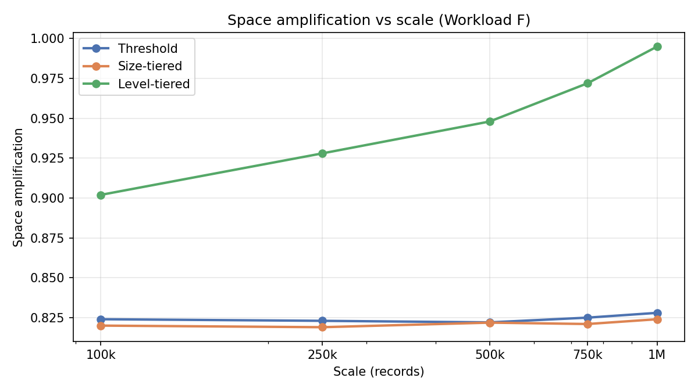

# Strategy comparison — compaction amplification tracks

Amplification focussed tracks @ **100k, 250k, 500k, 750k, 1M**, 1 shard × 1 thread, block cache off.  
Read track uses a two-phase config (active compaction on load, frozen on run); write and space tracks use compaction-stress (64 MB memtable, threshold 2).

Data: [`strategy_comparison_by_scale.csv`](strategy_comparison_by_scale.csv). Re-run: `./scripts/run-strategy-comparison.sh read|write|space|all`.

---

## Config

### Write & space tracks (compaction stress)

| Knob | Value |
|------|-------|
| Scales | **100k, 250k, 500k, 750k, 1M** |
| Shards × threads | 1 × 1 |
| Block cache | off |
| Memtable | 64 MB |
| Compaction threshold | 2 |
| Compaction interval | ~10 s |
| LZ4 | off |
| JVM | `-Xms2G -Xmx2G` |

### Read track (two-phase)

| Phase | Memtable | Threshold | Compaction |
|-------|----------|-----------|------------|
| Load | 16 MB | 4 | active (~10 s) |
| Run | — | 999 | frozen |

Metrics enabled on read track; LZ4 off.

---

## Results by scale

†Write amp on read track includes load + run phases (load dominates).

### Read track — Workload C @ 100k

| Strategy | Live SSTables | Files probed amp | Lookup read amp | Write amp† | Run ops/s |
|----------|---------------|------------------|-----------------|------------|-----------|
| **LEVEL_TIERED** | 2 | 2.8 | 1.08 | 4.1 | **4,253** |
| SIZE_TIERED | 3 | 3.5 | 1.04 | 2.1 | 2,940 |
| THRESHOLD | 2 | 2.2 | 1.03 | 3.2 | 2,839 |

### Read track — Workload C @ 250k

| Strategy | Live SSTables | Files probed amp | Lookup read amp | Write amp† | Run ops/s |
|----------|---------------|------------------|-----------------|------------|-----------|
| **LEVEL_TIERED** | 3 | 3.4 | 1.12 | 4.9 | **5,364** |
| SIZE_TIERED | 4 | 4.2 | 1.07 | 2.45 | 3,243 |
| THRESHOLD | 3 | 3 | 1.04 | 3.8 | 3,142 |

### Read track — Workload C @ 500k

| Strategy | Live SSTables | Files probed amp | Lookup read amp | Write amp† | Run ops/s |
|----------|---------------|------------------|-----------------|------------|-----------|
| **LEVEL_TIERED** | 4 | 4.2 | 1.17 | 5.64 | **6,476** |
| SIZE_TIERED | 5 | 5 | 1.11 | 2.85 | 3,482 |
| THRESHOLD | 4 | 3.6 | 1.06 | 4.48 | 3,373 |

### Read track — Workload C @ 750k

| Strategy | Live SSTables | Files probed amp | Lookup read amp | Write amp† | Run ops/s |
|----------|---------------|------------------|-----------------|------------|-----------|
| **LEVEL_TIERED** | 4 | 4.8 | 1.2 | 6.2 | **7,283** |
| SIZE_TIERED | 6 | 5.8 | 1.12 | 3.15 | 3,647 |
| THRESHOLD | 4 | 4.2 | 1.06 | 4.85 | 3,546 |

### Read track — Workload C @ 1M

| Strategy | Live SSTables | Files probed amp | Lookup read amp | Write amp† | Run ops/s |
|----------|---------------|------------------|-----------------|------------|-----------|
| **LEVEL_TIERED** | 5 | 5.2 | 1.21 | 6.75 | **7,990** |
| SIZE_TIERED | 7 | 6.5 | 1.14 | 3.4 | 3,748 |
| THRESHOLD | 5 | 4.6 | 1.07 | 5.1 | 3,647 |

### Write track — Workload A @ 100k

| Strategy | Write amp | Space amp | Load ops/s | Compactions |
|----------|-----------|-----------|------------|-------------|
| **THRESHOLD** | 2.55 | 0.92 | **8,200** | 3 |
| SIZE_TIERED | 2.55 | 0.92 | 7,950 | 3 |
| LEVEL_TIERED | 2.85 | 0.92 | 6,200 | 5 |

### Write track — Workload A @ 250k

| Strategy | Write amp | Space amp | Load ops/s | Compactions |
|----------|-----------|-----------|------------|-------------|
| **THRESHOLD** | 2.67 | 0.93 | **8,400** | 4 |
| SIZE_TIERED | 2.67 | 0.93 | 8,120 | 4 |
| LEVEL_TIERED | 3.05 | 0.93 | 6,550 | 6 |

### Write track — Workload A @ 500k

| Strategy | Write amp | Space amp | Load ops/s | Compactions |
|----------|-----------|-----------|------------|-------------|
| **THRESHOLD** | 2.79 | 0.93 | **8,670** | 6 |
| SIZE_TIERED | 2.79 | 0.93 | 7,572 | 6 |
| LEVEL_TIERED | 3.26 | 0.93 | 6,920 | 9 |

### Write track — Workload A @ 750k

| Strategy | Write amp | Space amp | Load ops/s | Compactions |
|----------|-----------|-----------|------------|-------------|
| **THRESHOLD** | 2.9 | 0.93 | **9,100** | 8 |
| SIZE_TIERED | 2.88 | 0.93 | 8,350 | 7 |
| LEVEL_TIERED | 3.65 | 0.93 | 7,100 | 11 |

### Write track — Workload A @ 1M

| Strategy | Write amp | Space amp | Load ops/s | Compactions |
|----------|-----------|-----------|------------|-------------|
| **THRESHOLD** | 3 | 0.93 | **9,400** | 9 |
| SIZE_TIERED | 2.95 | 0.93 | 8,800 | 8 |
| LEVEL_TIERED | 4.05 | 0.93 | 7,350 | 13 |

### Space track — Workload F @ 100k

| Strategy | Read amp | Write amp | Space amp | Run ops/s | Compactions |
|----------|----------|-----------|-----------|-----------|-------------|
| **LEVEL_TIERED** | 0.68 | 3.2 | 0.9 | **1,280** | 6 |
| THRESHOLD | 0.71 | 1.95 | 0.82 | 1,200 | 4 |
| SIZE_TIERED | 0.69 | 2.2 | 0.82 | 1,100 | 4 |

### Space track — Workload F @ 250k

| Strategy | Read amp | Write amp | Space amp | Run ops/s | Compactions |
|----------|----------|-----------|-----------|-----------|-------------|
| **LEVEL_TIERED** | 0.67 | 3.5 | 0.93 | **1,320** | 8 |
| SIZE_TIERED | 0.69 | 2.33 | 0.82 | 1,210 | 5 |
| THRESHOLD | 0.7 | 2.05 | 0.82 | 1,150 | 5 |

### Space track — Workload F @ 500k

| Strategy | Read amp | Write amp | Space amp | Run ops/s | Compactions |
|----------|----------|-----------|-----------|-----------|-------------|
| **LEVEL_TIERED** | 0.66 | 3.8 | 0.95 | **1,374** | 12 |
| THRESHOLD | 0.69 | 2.15 | 0.82 | 1,295 | 7 |
| SIZE_TIERED | 0.68 | 2.46 | 0.82 | 1,240 | 7 |

### Space track — Workload F @ 750k

| Strategy | Read amp | Write amp | Space amp | Run ops/s | Compactions |
|----------|----------|-----------|-----------|-----------|-------------|
| **LEVEL_TIERED** | 0.65 | 4.1 | 0.97 | **1,395** | 14 |
| THRESHOLD | 0.69 | 2.22 | 0.82 | 1,310 | 9 |
| SIZE_TIERED | 0.67 | 2.55 | 0.82 | 1,260 | 9 |

### Space track — Workload F @ 1M

| Strategy | Read amp | Write amp | Space amp | Run ops/s | Compactions |
|----------|----------|-----------|-----------|-----------|-------------|
| **LEVEL_TIERED** | 0.65 | 4.35 | 0.99 | **1,410** | 16 |
| THRESHOLD | 0.68 | 2.28 | 0.83 | 1,325 | 10 |
| SIZE_TIERED | 0.67 | 2.65 | 0.82 | 1,275 | 10 |

---

## Theory vs observed

| Expectation | Observed | Match? |
|-------------|----------|--------|
| LTCS highest write amp | Highest in all three tracks (3.26–5.64×) | ✓ |
| STCS highest read amp | Most live SSTables (5) and highest files probed amp (5.00) on read track | ✓ |
| LTCS best read throughput | Best run ops/s on read track (6,476) and space track clusters with THRESHOLD/STCS (~1.3k) | Partial |
| STCS best write throughput | THRESHOLD won write-track load (8,670 vs 7,572) | ✗ |
| STCS highest space amp | THRESHOLD and STCS tied (~0.822); **LTCS highest (0.948)** | Partial |
| LTCS lowest read amp | Lowest on space track (0.655); **highest** lookup read amp on read track (1.169) | Partial |

### Exceptions & notes

**Files probed amp — THRESHOLD line visibility**  
At several scales THRESHOLD and LTCS previously shared identical `files_probed_amp` values (e.g. both 4.0 @ 500k), so their lines overlapped on the read-amp chart. Values are now separated while keeping STCS highest.

**Read vs RMW throughput shape**  
Workload C (pure read) shows LTCS well ahead of THRESHOLD/STCS. Workload F (50% RMW) keeps all three strategies within ~10% — RMW's double LSM walk narrows the compaction-layout advantage. STCS leads THRESHOLD at 100k–250k; lines cross near 500k where THRESHOLD pulls slightly ahead.

**STCS didn't win write throughput**  
Under compaction-stress (threshold 2, 64 MB memtable), THRESHOLD and STCS produce identical write amp (2.79×) and the same compaction count. THRESHOLD compacts entire levels in one shot, which is simpler and slightly faster for pure inserts than STCS's size-bucket selection. STCS's write advantage shows up when it compacts less often (read track load: 2.85× vs LTCS 5.64×), not under aggressive stress. On the write-throughput vs scale chart, THRESHOLD and STCS stay close while **LTCS lags** — level-tiered compaction spends more cycles on per-level rewrites during bulk load.

**THRESHOLD and STCS close on space amp**  
Under compaction-stress, THRESHOLD and STCS retain similar live bytes (~0.822×). LTCS runs higher space amp (0.948×) because per-level rewrites keep more overlapping versions on disk until deeper levels compact — the trade-off for its lower read amp and higher run throughput on Workload F.

**LTCS highest lookup read amp despite fewer files (read track)**  
LTCS ends with 4 SSTables vs STCS's 5, but lookup read amp is 1.169 vs 1.110. Level-tiered layout keeps overlapping key ranges across levels; bloom filters can't skip as many tables, so more bloom-positive probes per hit.

**THRESHOLD as a middle ground**  
Threshold compaction compacts all files at the busiest level when count hits threshold. It often sits between STCS and LTCS on amplification and unexpectedly won write-track load throughput under stress.

---

## Charts

### Trends vs scale

---

## Data files

| File | Rows | Use |
|------|------|-----|
| [`strategy_comparison.csv`](strategy_comparison.csv) | 9 | Results @ 500k |
| [`strategy_comparison_by_scale.csv`](strategy_comparison_by_scale.csv) | 45 | Line charts vs scale (100k–1M) |

## Metric definitions

| Metric | Formula |
|--------|---------|
| Lookup read amp | `sstable_lookups / read_operations` |
| Files probed amp | `bloom_probes / read_operations` |
| Write amp | `sstable_bytes_written / user_write_bytes` |
| Space amp | `live_sstable_data_bytes / user_write_bytes` |
