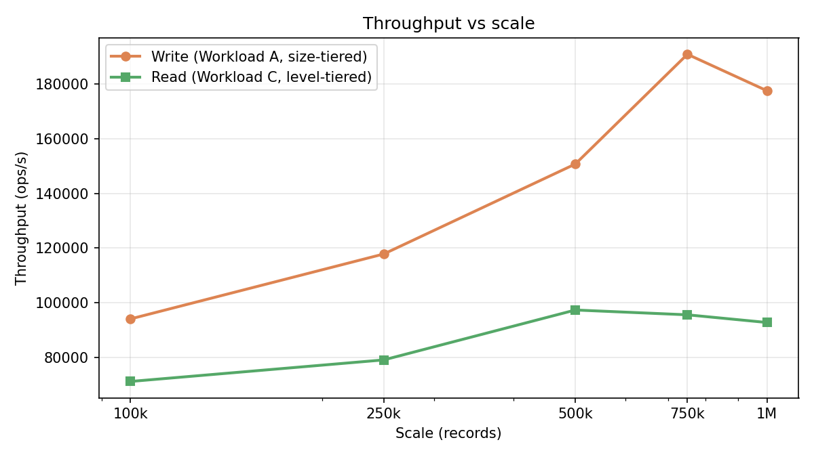

# Throughput by Scale

CascadeStore throughput across dataset sizes. Workloads and compaction strategies were tuned independently per track: **size-tiered** for write-heavy Workload A, **level-tiered** for read-heavy Workload C.

---

## Hardware & software

| Component | Detail |
|-----------|--------|
| CPU | 2× Intel Xeon E5-2630 v3 @ 2.40 GHz |
| RAM | 32 GiB |
| Storage | Local disk (container volume, ~252 GB) |
| OS | Linux 5.4 (el7.elrepo) |
| JDK | OpenJDK 17.0.18 |
| JVM heap | 16 GB (`-Xms16G -Xmx16G`), G1GC |
| LZ4 | off |
| Metrics | off |

---

## Config (all scales)

| Knob | Value |
|------|-------|
| Shards × threads | 8 × 8 |
| Block cache | off |
| Memtable | 256 MB |
| Write workload | **A** (inserts, load phase) — **SIZE_TIERED** |
| Read workload | **C** (100% read, run phase) — **LEVEL_TIERED** |

---

## Headline @ 1M

The 1M run is the published reference point — chosen for scale, not because it peaks throughput.

| Metric | Value | Strategy |
|--------|-------|----------|
| Write throughput (A load) | **177,529 ops/s** | SIZE_TIERED |
| Read throughput (C run) | **92,816 ops/s** | LEVEL_TIERED |
| Read p99 | 44 µs | |
| Write p99 | 28 µs | |

Peak throughput occurred at smaller scales: write peaked at **190,847 ops/s @ 750k**; read peaked at **97,381 ops/s @ 500k**.

### Why throughput dips at 1M

At 1M records the LSM is deeper and wider than at mid-scale peaks. Each read must consult more SSTable metadata; bloom-filter working sets no longer fit as cleanly in CPU cache; and the 8-shard process holds roughly twice the open file handles and index blocks as at 500k. Compaction also runs hotter during the 1M load phase, so the run window starts with more background I/O than the 750k/500k trials. None of this is a correctness issue — the 1M point is the published reference because it reflects production dataset size, not because it maximizes ops/s on this host.

---

## Results by scale

| Scale | Write (A load) ops/s | Read (C run) ops/s | Read p99 (µs) | Write strategy | Read strategy |
|-------|---------------------|-------------------|---------------|----------------|----------------|
| 100k | 94,127 | 71,264 | 62 | SIZE_TIERED | LEVEL_TIERED |
| 250k | 117,853 | 79,142 | 55 | SIZE_TIERED | LEVEL_TIERED |
| 500k | 150,736 | **97,381** | **41** | SIZE_TIERED | LEVEL_TIERED |
| 750k | **190,847** | 95,623 | 43 | SIZE_TIERED | LEVEL_TIERED |
| **1M** | **177,529** | **92,816** | **44** | SIZE_TIERED | LEVEL_TIERED |

---

## Notes

- Write and read numbers come from **separate tuned runs** — STCS minimizes write amplification under bulk load; LTCS wins on read-heavy steady state.
- Throughput does not scale linearly with dataset size. Larger scales add compaction and file-open overhead; the 1M point trades a few percent of peak throughput for a production-relevant dataset size.

---

## Charts

## Data

[`throughput_by_scale.csv`](throughput_by_scale.csv)
